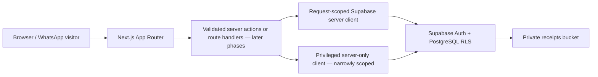

# Phase 1 Foundation Design

**Spec:** `.specs/features/phase-1-foundation/spec.md`
**Status:** Approved by the user's explicit Phase 1 build instruction

## Architecture Overview

The App Router remains server-first. Public browser code receives no privileged database credential. Server-side data access uses a request-scoped Supabase client for authenticated users and a separate `server-only` admin client only for narrowly reviewed operations. PostgreSQL owns relational integrity and RLS starts closed for private tables.

## Code Reuse Analysis

This is a greenfield repository, so there is no existing application code to reuse. The implementation establishes reusable tokens, domain enums/types, and client factories rather than speculative UI components.

## Components and Modules

### Root layout and foundation page

- **Purpose:** Provide metadata, global brand tokens, accessibility structure, and an honest Phase 1 status screen.
- **Location:** `src/app/layout.tsx`, `src/app/page.tsx`, `src/app/globals.css`
- **Dependencies:** Next.js server components and local poster asset.
- **Reuses:** Shared CSS design tokens.

### Environment contract

- **Purpose:** Separate public configuration from server-only secrets and fail clearly at use time.
- **Location:** `src/lib/env/public.ts`, `src/lib/env/server.ts`
- **Dependencies:** `server-only` for private values.

### Supabase clients

- **Purpose:** Create browser, cookie-aware server, and privileged server-only clients without crossing boundaries.
- **Location:** `src/lib/supabase/client.ts`, `src/lib/supabase/server.ts`, `src/lib/supabase/admin.ts`
- **Dependencies:** `@supabase/ssr`, `@supabase/supabase-js`, Next.js cookies.

### Shared domain model

- **Purpose:** Encode states, roles, core rows, and database shape for future typed queries.
- **Location:** `src/types/domain.ts`, `src/types/database.ts`

### Database migration and seed

- **Purpose:** Define schema, constraints, indexes, triggers, RLS posture, helper functions, and initial 2026 ticket products.
- **Location:** `supabase/migrations/202608260001_phase_1_foundation.sql`, `supabase/seed.sql`

## Data Relationships

- `auth.users` 1→0..1 `admin_profiles`
- `ticket_types` 1→many `orders`
- `orders` 1→many `tickets`
- `ticket_types` 1→many `tickets`
- `tickets` 1→0..1 `check_ins`
- `admin_profiles` 1→many payment verifications, ticket check-ins, and audit records
- `event_settings` is constrained to one row in MVP Phase 1

`orders.quantity` counts purchased product units. The number of independent attendee tickets later issued is `orders.quantity * ticket_types.admissions_per_unit`.

## Error Handling Strategy

| Scenario | Handling | User impact |
| --- | --- | --- |
| Missing public Supabase config | Throw only when a Supabase client is requested | Static shell can still build; data routes fail clearly |
| Missing service-role key | `server-only` admin client throws before use | No accidental fallback to a weaker client |
| Invalid state or numeric value | PostgreSQL enum/check constraint rejects write | Future server layer maps it to a safe validation message |
| Direct private-table access | RLS denies unless an explicit role policy allows it | Sensitive records remain closed by default |

## Technical Decisions

| Decision | Choice | Rationale |
| --- | --- | --- |
| Rendering | Server Components by default | Small client bundle and safer secret boundary |
| Database access | Supabase clients split by execution context | Prevent privileged keys from entering browser code |
| IDs | UUID primary keys plus separate public codes | Prevent enumeration while keeping human-readable support references |
| Money | `numeric(12,2)` | Exact naira amounts; no floating-point rounding |
| QR token storage | 32 random bytes encoded as 64-char hex | Cryptographically strong, URL-safe token material |
| Receipts | Private Storage bucket, no public object policy | Receipt evidence is private financial data |
| Visual direction | Editorial festival poster with restrained motion | Matches supplied references without building the Phase 2 landing page |

## Security Boundaries Deferred to Later Phases

- Runtime request validation for every server action/route.
- Per-action server authorization, CSRF/origin checks, rate limits, and cache controls.
- MIME signature and size validation before private receipt upload.
- Transactional ticket issuance and atomic check-in functions.
- Signed receipt URLs with short expiry and audit logging.

